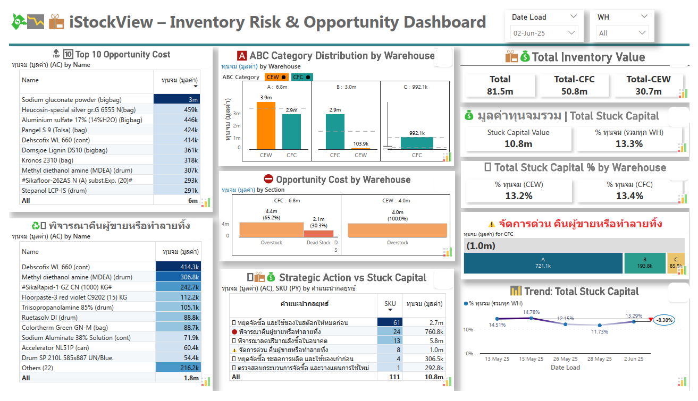
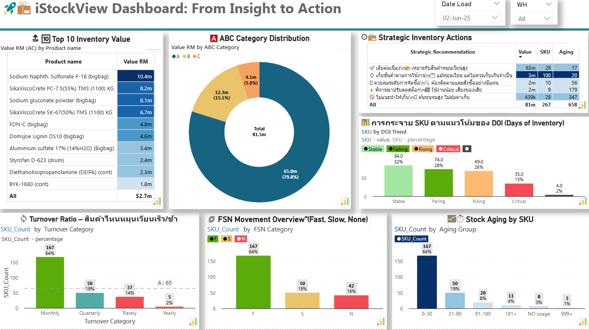

# iStockView – AI Strategic BI Template for Power BI 🚀📊

> Strategic Inventory Intelligence from Insight to Action

**iStockView** คือ Power BI Template สำหรับการวิเคราะห์สินค้าคงคลังเชิงกลยุทธ์ พร้อมแนวทางการตัดสินใจที่ขับเคลื่อนด้วยข้อมูลจริง ช่วยลดทุนจม เพิ่มประสิทธิภาพ และสร้างผลลัพธ์ที่จับต้องได้

---

## 🌟 Key Features

- 🧠 Weighted Score Model วิเคราะห์ SKU ตามปัจจัยกลยุทธ์
- 📦 ABC & FSN Classification
- ⏳ Aging, DOI, Turnover วิเคราะห์สุขภาพคลัง
- 💸 Recovery Insights หาทุนจมที่กู้คืนได้
- 📊 Dashboards พร้อมใช้สำหรับฝ่ายบริหาร

---

## 🖼️ Dashboard Preview

> *แสดงข้อมูล Inventory Health, KPI และ Strategic Action*

> *แสดงทุนจม, โอกาสในการกู้คืน, และคลังที่มีความเสี่ยง*

---

## 🛠️ วิธีใช้งาน

1. เปิด Power BI Desktop แล้วโหลดไฟล์ `.pbit`
2. เชื่อมต่อกับข้อมูล Inventory ขององค์กรคุณ
3. ปรับแต่ง Weighted Logic ตามกลยุทธ์ขององค์กร
4. พร้อมใช้ในการวิเคราะห์และตัดสินใจระดับผู้บริหาร

---

## 👨‍💼 ติดต่อ

📧 benjaja60@gmail.com

---

© 2025 iStockView – Strategic BI Template
